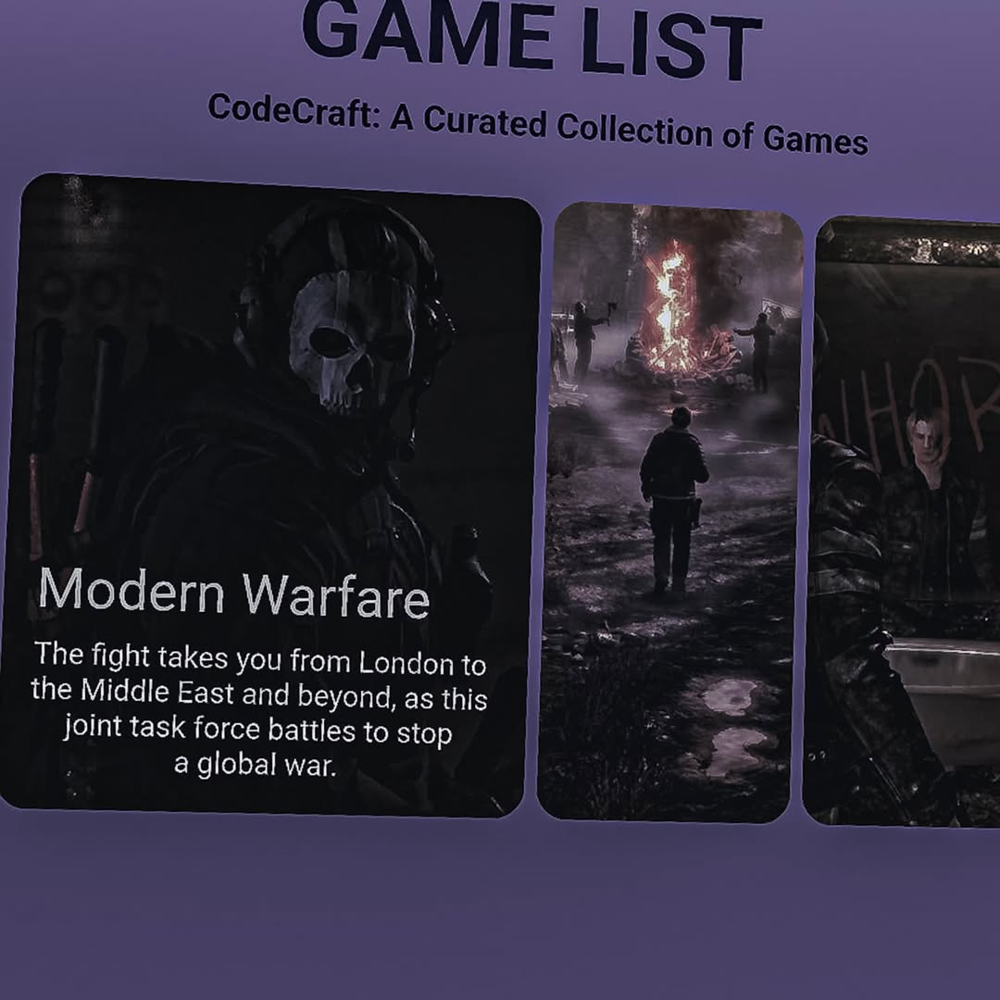

٤ة# 🎮 Interactive Game List with Hover Effects

This project showcases a **responsive and interactive game list**. When you hover over any game card, it expands smoothly and reveals beautifully animated details about the game, resembling a mini game review panel.

---

##  Features

- Smooth **hover animations** with transitions  
- Reveals game **details and captions** on interaction  
- Clean and modern **card-based layout**  
- Lightweight and easily customizable for personal use  

---

## 📸 Preview

> 💡 Make sure to set the image path correctly in `index.html` for the preview to display.

```html
<!-- Example in index.html -->

```
---
## 🖼️ Live Preview Screenshot

Below is a screenshot of the **hover effect in action** — when the user hovers over a game card, it expands and displays game information with smooth transitions and styling:


---
🔗 [Live Demo](https://hassanowner.github.io/game-hover-list/main/))
